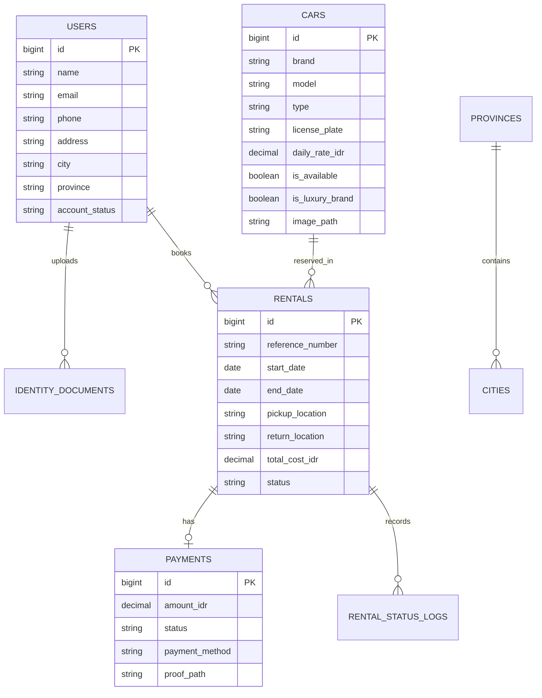

<p align="center">
  <h1 align="center">🚘 CarRental — Premium Car Rental & Inventory Platform</h1>
  <p align="center">
    A modern, high-performance car rental reservation and management application tailored for Indonesian rental operations.
  </p>
</p>

<p align="center">
  <a href="#key-features">Key Features</a> •
  <a href="#technology-stack">Tech Stack</a> •
  <a href="#database-schema--models">Database & Models</a> •
  <a href="#application-workflows">Workflows</a> •
  <a href="#installation--setup">Setup Guide</a> •
  <a href="#testing">Testing</a>
</p>

---

## 📌 Project Overview

**CarRental** is a full-stack web platform designed to streamline car rental operations in Indonesia. It combines **Online Self-Service Reservations** for customers with **In-Person Office Asset Operations** for administrators:

* **Customer Web Portal**: Customers register with regional location selection (all 38 Indonesian provinces), upload KTP identity documents for verification, explore available vehicles with real-time price estimation, and submit booking requests (starting H+1).
* **Filament Admin Panel (`/admin`)**: Administrators inspect customer KTP documents via secure AWS S3 previews, approve KYC verifications, manage vehicle inventory, process on-site office payments (Cash, EDC, QRIS, Bank Transfer), and execute post-rent vehicle return inspections.

---

## 🛠️ Technology Stack

| Component | Technology / Library |
| :--- | :--- |
| **Backend Core** | **Laravel 11** (PHP 8.2+) |
| **Reactive Frontend** | **Livewire 3** + Blade Templating + **Tailwind CSS** |
| **Admin Panel** | **Filament v3** Admin Suite |
| **Cloud Storage** | **AWS S3** Object Storage (`league/flysystem-aws-s3-v3` with 15-min secure presigned URLs) |
| **API Subsystem** | **Laravel Sanctum** (REST API v1 Endpoints) |
| **Database** | **MySQL** / MariaDB (Seeded with 38 Indonesian Provinces & Cities) |
| **Email Gateway** | Resend API / Log Driver Integration |
| **Test Suite** | **PHPUnit** (185 Automated Unit & Feature Tests) |

---

## ✨ Key Features

### 👤 Customer Experience
- 📝 **Fast Account Registration**: Instant activation with dynamic cascading **Province & City/Regency** selection covering all **38 Indonesian Provinces**.
- 🪪 **KTP Identity Verification (KYC)**: Upload KTP document with live status feedback (*Pending Approval: 5–10 minutes*).
- 🚗 **Interactive Vehicle Catalog**: Search and filter by brand, vehicle type (City Car, SUV, MPV, Sedan), capacity, and luxury tier.
- 🧮 **Real-time Price Estimator**: Calculates total cost instantly based on selected dates and luxury brand multipliers.
- 📅 **H-1 Advance Reservation**: Booking form enforces a minimum H-1 start date for office preparation.
- 🏢 **Fixed Office Pickup & Return**: Clear instructions specifying pickup and drop-off at **Kantor Utama (Jl. Pemuda No. 1, Medan)** with dedicated destination purpose input.
- 📋 **My Booking History (`/my-rentals`)**: View past & active bookings with an **Interactive Detail Popup Modal**.

### 🛡️ Admin Dashboard (`/admin`)
- 🔒 **Restricted Authorization**: Panel access strictly controlled via Laravel policies and `FilamentUser` interface.
- 🔍 **Customer Detail Modal**: Inspector modal showing customer profile, phone, address, and high-resolution KTP image preview from private AWS S3 bucket.
- 🚗 **Vehicle Fleet Management**: Add, edit, and toggle vehicle availability with automatic redirect to the vehicle catalog table.
- 🔑 **Office Payment & Key Handover**: One-click action to record office payments (Cash/EDC/QRIS) and transition rental status to `Active`.
- 🔄 **Vehicle Return Inspection**: One-click action (**Terima Pengembalian Mobil**) upon vehicle drop-off, marking rental as `Completed` and restoring car availability automatically.

---

## 🗄️ Database Schema & Models

The database structure consists of **7 primary tables**:



---

## 🔄 Application Workflows

### 1️⃣ Customer Onboarding & KTP Review
```
[Customer Register] ➔ [Upload KTP in Profile] ➔ [Status: Pending Review (5-10 Min)]
                                                        │
                                                        ▼
[Booking Form Unlocked] ◄── [Setujui KTP] ◄── [Admin Inspects KTP in /admin]
```

### 2️⃣ Booking & Vehicle Retrieval Lifecycle
```
[Customer Selects Car & Dates (Min H-1)] ➔ [Enters Destination] ➔ [Submit Reservation]
                                                                        │
                                                                        ▼
                                                         [Customer Visits Office]
                                                                        │
                                                                        ▼
[Car Status: Active / Rented] ◄── [Keys Handed Over] ◄── [Admin Clicks "Bayar & Serahkan Kunci"]
           │
           ▼
[Customer Returns Car to Office] ➔ [Admin Clicks "Terima Pengembalian Mobil"] ➔ [Rental: Completed & Car: Available]
```

---

## 📂 AWS S3 Bucket Storage Layout

```
carrental-app-storage/
├── cars/               # Public vehicle photos uploaded by Admin
├── identity-documents/ # Private customer KTP / SIM uploads (Served via 15-min presigned URLs)
└── livewire-tmp/       # Temporary upload buffer
```

---

## 🚀 Installation & Local Setup

### Prerequisites
* PHP 8.2 or higher
* Composer
* Node.js & NPM
* MySQL / MariaDB

### Step-by-Step Guide

1. **Clone the repository**:
   ```bash
   git clone https://github.com/AuroSilalahi/CarRental.git
   cd CarRental
   ```

2. **Install PHP & Node Dependencies**:
   ```bash
   composer install
   npm install
   ```

3. **Configure Environment File**:
   Copy `.env.example` to `.env`:
   ```bash
   cp .env.example .env
   ```
   Set your database & storage credentials in `.env`:
   ```env
   DB_CONNECTION=mysql
   DB_HOST=127.0.0.1
   DB_PORT=3306
   DB_DATABASE=car_rental
   DB_USERNAME=root
   DB_PASSWORD=

   FILESYSTEM_DISK=s3
   MAIL_MAILER=log
   ```

4. **Generate Application Key**:
   ```bash
   php artisan key:generate
   ```

5. **Run Database Migrations & Seeders**:
   ```bash
   php artisan migrate:fresh --seed
   ```
   *(This seeds the database with sample cars, admin account, and all 38 Indonesian Provinces & Cities).*

6. **Create Storage Symlink**:
   ```bash
   php artisan storage:link
   ```

7. **Start Development Servers**:
   ```bash
   # Terminal 1: Run Laravel Server
   php artisan serve

   # Terminal 2 (Optional): Build Frontend Assets
   npm run dev
   ```

8. **Access Points**:
   * **Web App**: `http://localhost:8000`
   * **Admin Panel**: `http://localhost:8000/admin`
   * **Default Admin Credentials**:
     * Email: `admin@carrental.com`
     * Password: `password`

---

## 🧪 Testing

The project includes **185 automated unit and integration tests** covering API endpoints, availability logic, rental status transitions, pricing multipliers, and document upload validations.

To run the complete test suite:
```bash
php artisan test
```

---

## 📄 License

This project is open-source and built for portfolio and demonstration purposes.
